# AI-Powered Resume Ranking and Hiring System

A full-stack recruitment platform that streamlines hiring for both job seekers and employers. 
Job seekers can upload resumes, create profiles, and apply for job postings. Employers can 
create job postings, view all job applicants, and run an AI-based ranking system that ranks 
resumes using TF-IDF, Cosine Similarity, and Skill Matching through a FastAPI engine.

------------------------------------------------------------
🚀 FEATURES
------------------------------------------------------------

JOB SEEKER FEATURES:
- Create job seeker profile
- Upload resume (PDF/DOCX)
- Apply to jobs (resume auto-attached)
- View job listings

EMPLOYER FEATURES:
- Create employer profile
- Post new job openings
- View list of applicants
- Separate views: Unranked Applicants and Ranked Applicants
- Open resumes inside browser
- Download HTML-based report preview
- Download Excel-based ranking report

AI ENGINE FEATURES:
- Extracts text from PDF/DOCX resumes
- Preprocesses text: lowercase, tokenization, stopword removal, lemmatization
- Creates TF-IDF vectors (uses 1–2 gram range)
- Calculates cosine similarity between job description and resumes
- Automatically extracts skills from job description
- Computes skill-match ratio for each resume
- Combines both metrics into a weighted final score

FINAL SCORE FORMULA:
final_score = (1 - w) * cosine_similarity + w * skill_match_ratio

- Updates ranking values directly inside PostgreSQL
- Generates downloadable reports (HTML and Excel)

------------------------------------------------------------
🏛️ SYSTEM ARCHITECTURE
------------------------------------------------------------

FRONTEND (React + Tailwind CSS):
- Provides UI for both job seekers and employers
- Handles login, dashboards, job search, job posting, and viewing applicant resumes
- Communicates with both Express.js and FastAPI servers

EXPRESS.JS MAIN BACKEND:
- Handles authentication
- Manages job postings
- Manages resume uploads
- Stores resumes as BYTEA in PostgreSQL
- Provides applicant lists for employers

FASTAPI RANKING BACKEND:
- Performs resume text extraction
- NLP preprocessing
- TF-IDF vectorization
- Cosine similarity calculation
- Skill extraction and matching
- Final weighted ranking
- Writes updated rankings back into PostgreSQL
- Generates HTML & Excel reports

POSTGRESQL DATABASE:
- Stores login, job seekers, employers, job postings, applications, and rankings
- Stores resumes using BYTEA format internally

------------------------------------------------------------
▶️ HOW TO RUN THE PROJECT
------------------------------------------------------------

1) START REACT FRONTEND:
cd client
npm install
npm start

2) START MAIN EXPRESS SERVER:
cd main_server
npm install
node server.js

3) START FASTAPI RANKING SERVER:
cd ranking_server
pip install -r requirements.txt
uvicorn app.main:app --reload

------------------------------------------------------------
🖼️ FULL SCREENSHOTS (13 IMAGES)
------------------------------------------------------------

Below are ALL screenshots included in the project:

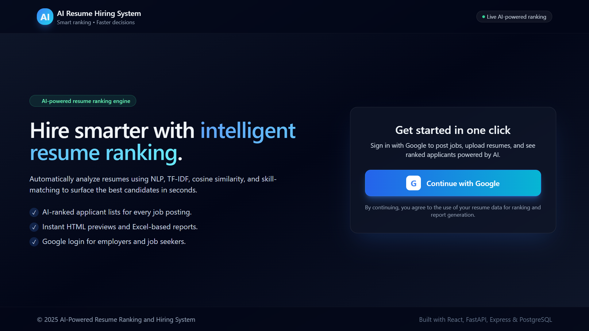

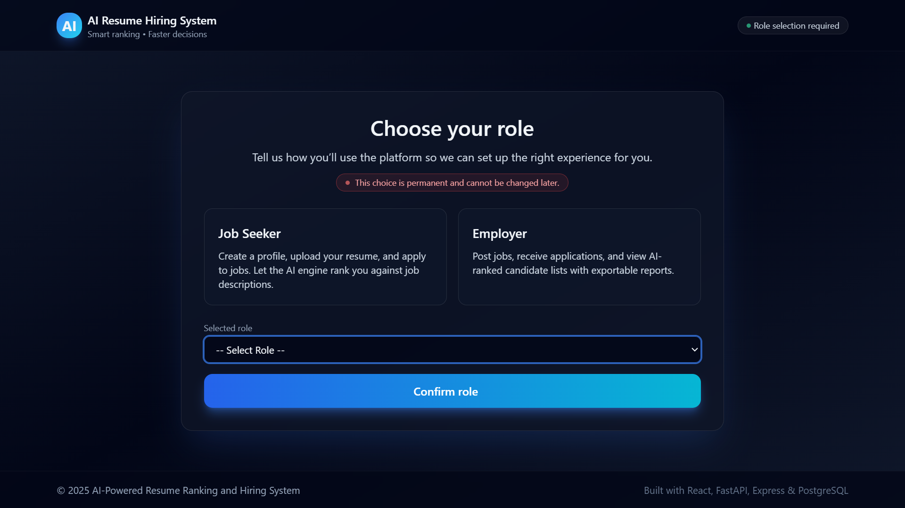

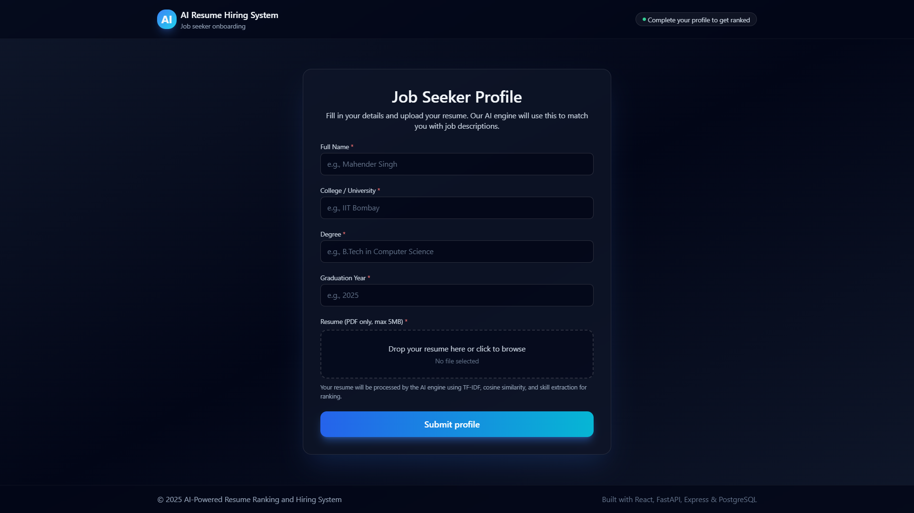

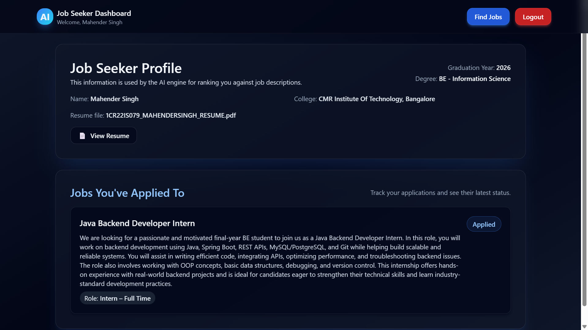

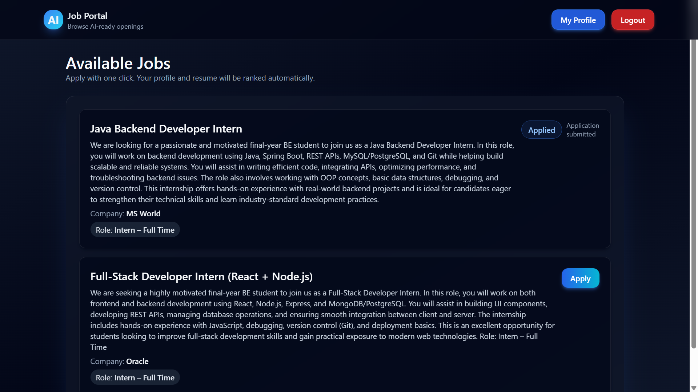

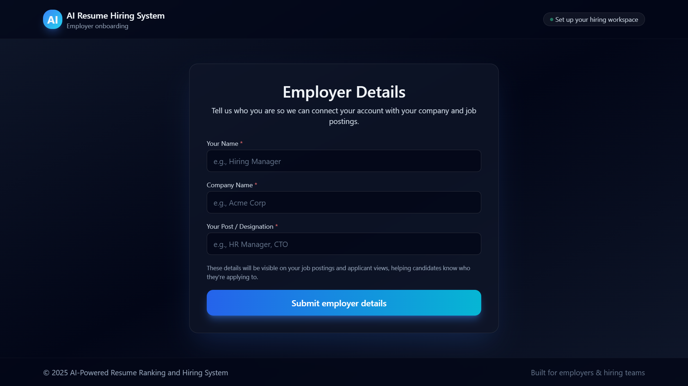

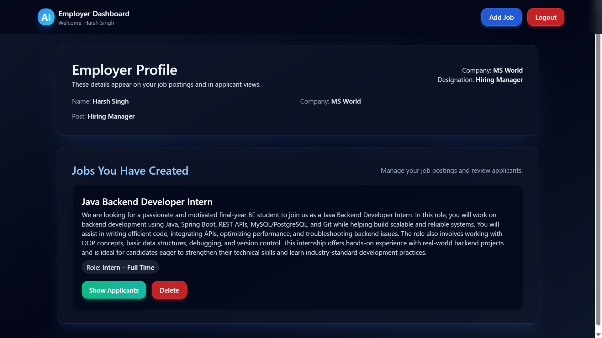

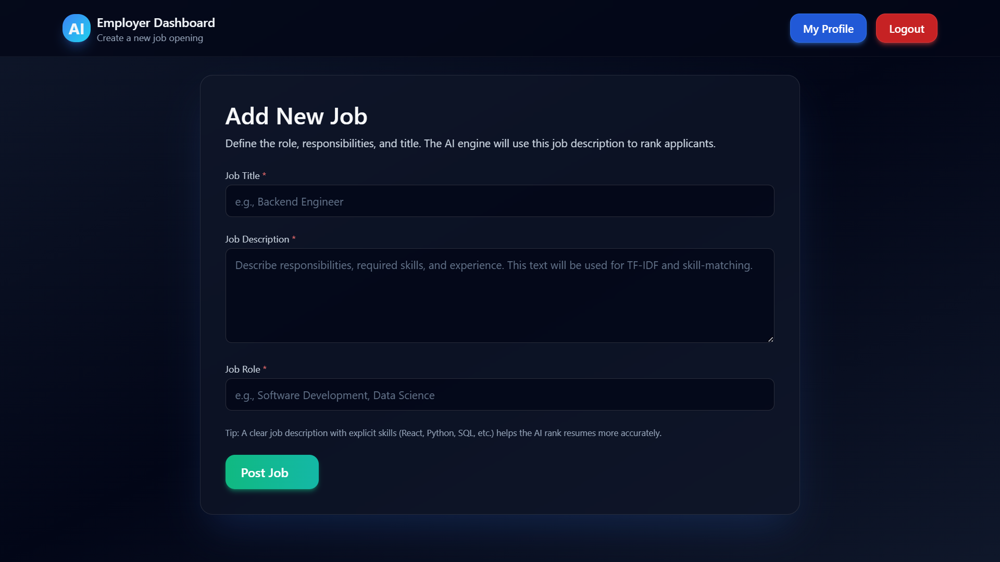

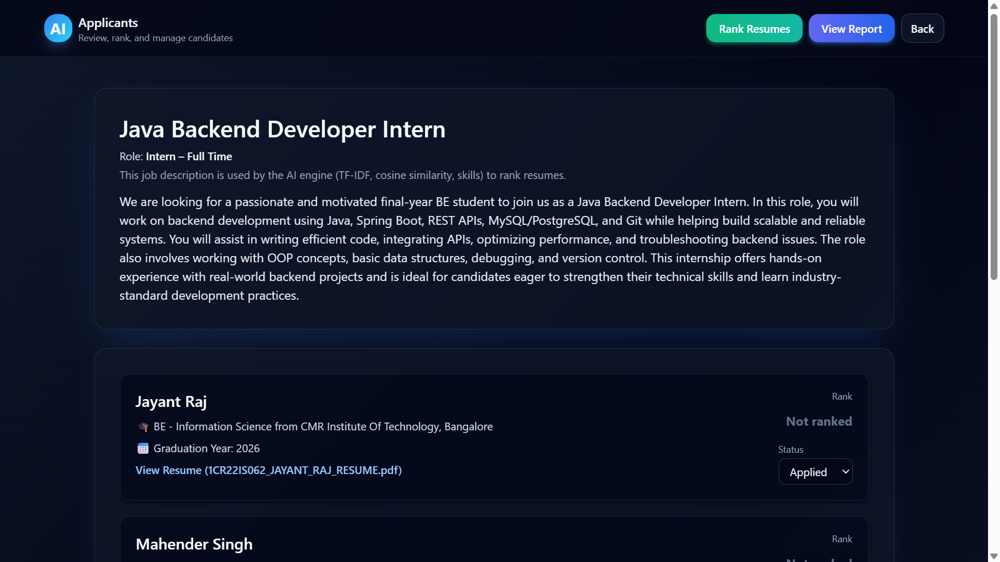

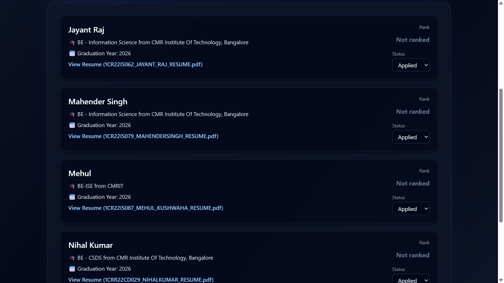

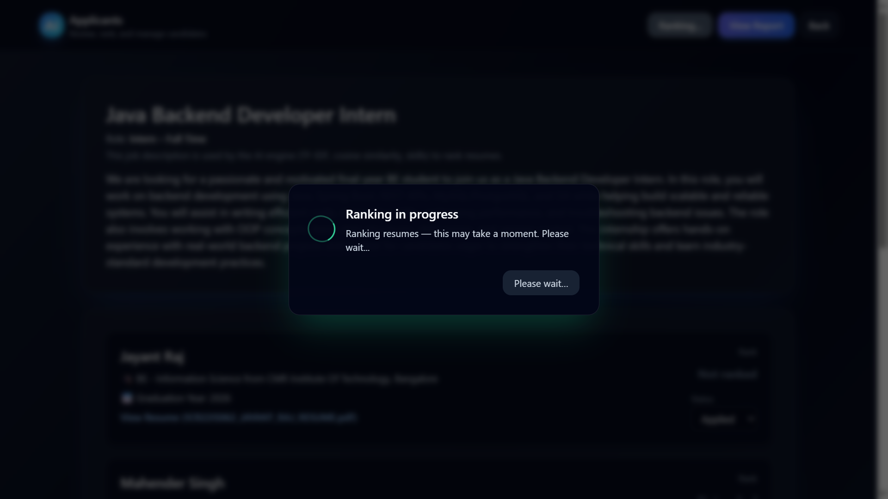

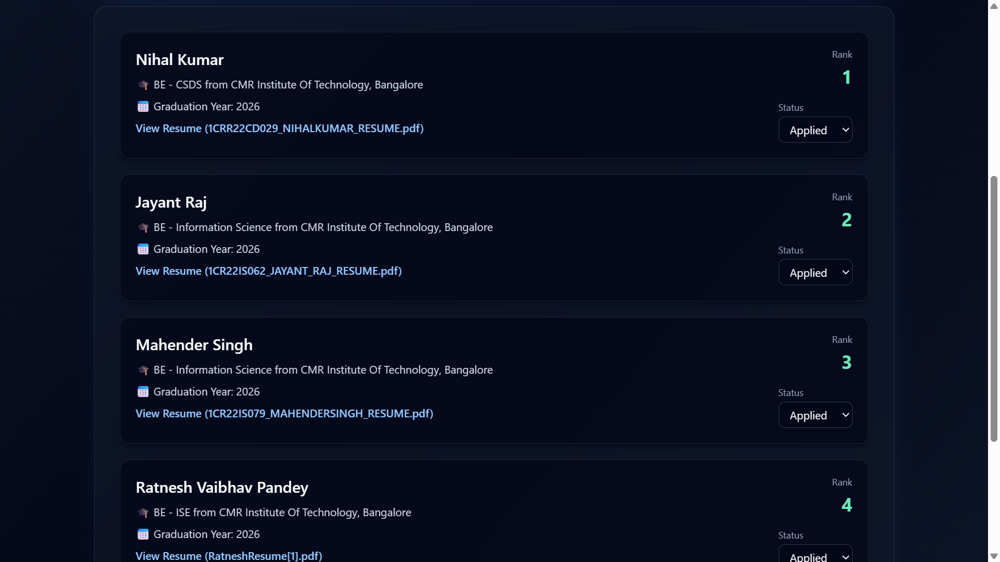

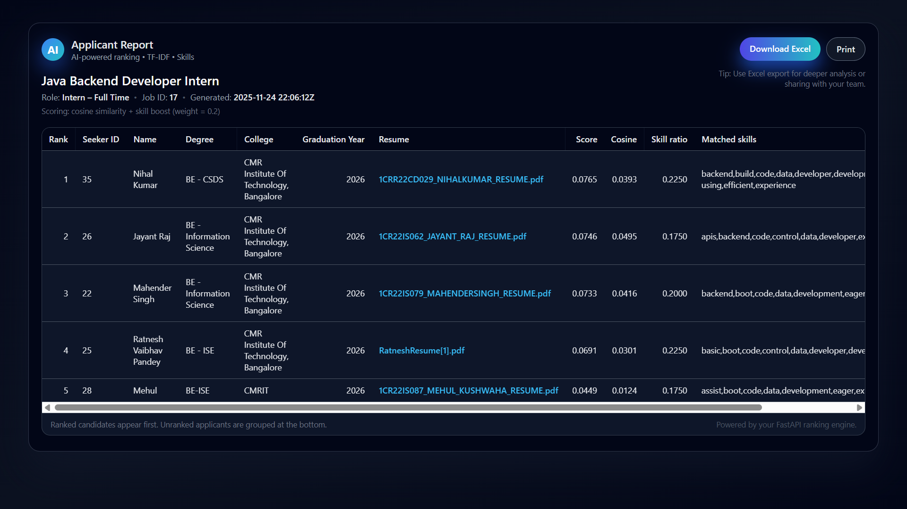

------------------------------------------------------------
🔮 FUTURE IMPROVEMENTS
------------------------------------------------------------

- Integration with semantic models like BERT / Sentence-BERT
- Lower false-negative skill detection using fuzzy matching
- Add OCR support for scanned PDF resumes
- Deploy as Dockerized microservices
- Add ATS-style candidate tracking
- Multi-language resume support
- Add recruiter analytics (graphs and visual insights)

------------------------------------------------------------
👨‍💻 AUTHOR
------------------------------------------------------------

Mahender Singh
